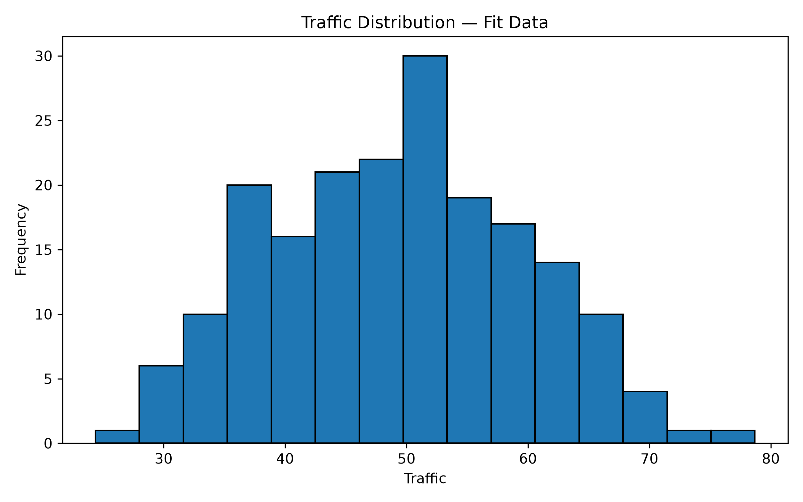
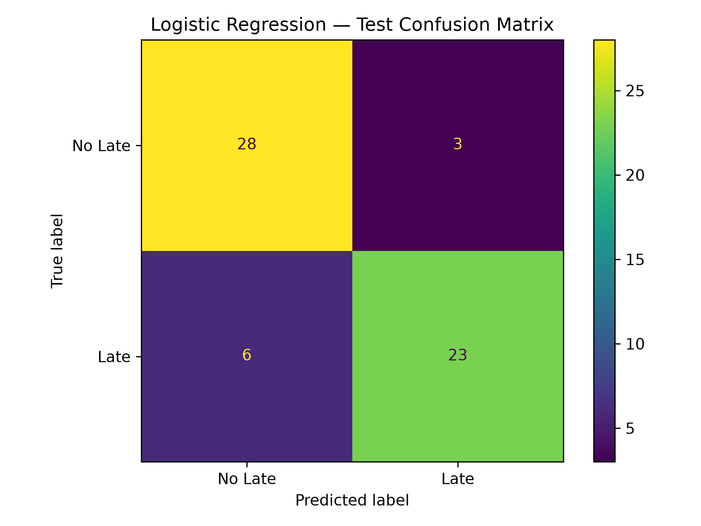
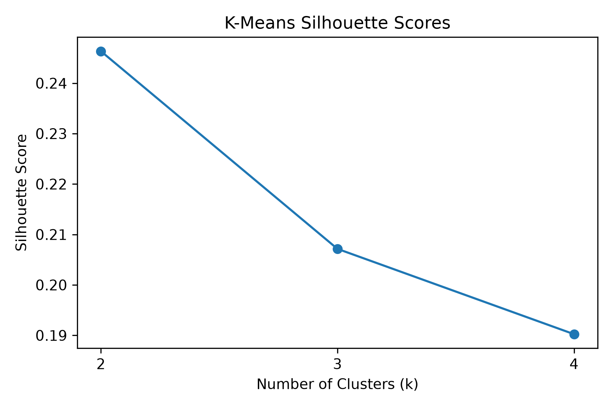
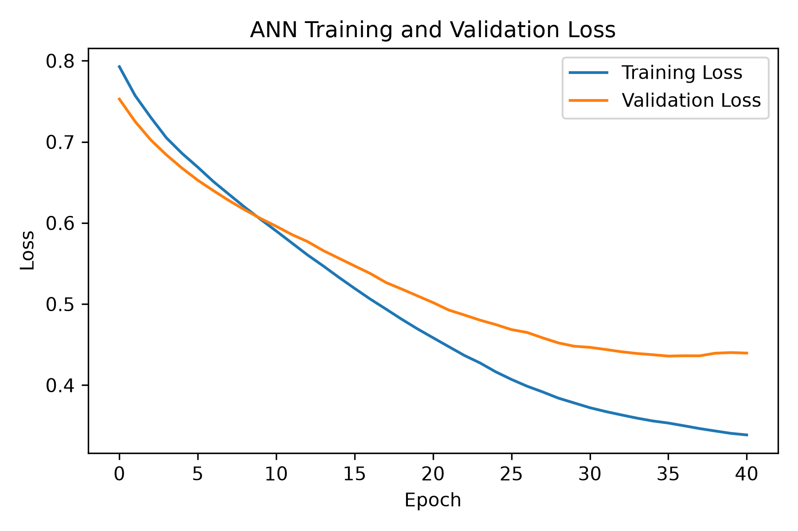

# 📊 Delivery Risk Prediction and Segmentation — Set C


> **Red & White Skill Education — Data Science & AI/ML Practical Exam, Set C**

---

## 📑 Table of Contents

- [📌 Project Overview](#-project-overview)
- [🎯 Objective](#-objective)
- [📂 Dataset](#-dataset)
- [🧹 Data Preparation](#-data-preparation)
- [📐 Technical Work](#-technical-work)
- [📊 Key Visualizations](#-key-visualizations)
- [📈 Model Evaluation](#-model-evaluation)
- [👥 Operational Segmentation](#-operational-segmentation)
- [🧠 ANN Details](#-ann-details)
- [🔐 Leakage Prevention](#-leakage-prevention)
- [🛠️ Tools & Technologies](#️-tools--technologies)
- [🚀 Installation & Usage](#-installation--usage)
- [📁 Project Structure](#-project-structure)
- [🧭 Repository Navigation](#-repository-navigation)
- [🎥 Project Demonstration](#-project-demonstration)
- [📦 Requirements](#-requirements)
- [👨‍💻 Author](#-author)
- [📚 References & Declaration](#-references--declaration)

---

# 📌 Project Overview

This project is based on the **Data Science & AI/ML Practical Exam — Set C**. It uses a synthetic operational dataset to **predict late deliveries and identify operational segments**.

The end-to-end workflow covers five compulsory technical modules:

1. **Maths & Advanced Statistics**
2. **Data Preprocessing & Feature Engineering**
3. **Supervised Learning**
4. **Unsupervised Learning**
5. **Deep Learning — Artificial Neural Network (ANN)**

The supplied data generator creates **305 rows**, including **5 exact duplicate records**. After duplicate removal, the clean dataset contains **300 unique records**. The original raw CSV should remain unchanged.

---

# 🎯 Objective

The main objectives of this project are to:

- Summarise observed `distance` values using descriptive statistics and a histogram.
- Compare the mean `distance` between groups G1 and G2 using a two-sided Welch t-test.
- Calculate a 95% confidence interval for the observed mean.
- Calculate a sample covariance matrix and analyse its eigenvalues.
- Prepare the data and engineer the required `engineered_feature` without leakage.
- Compare a majority-class baseline with Logistic Regression.
- Evaluate late-delivery predictions using accuracy, precision, recall, F1-score and a confusion matrix.
- Identify operational segments using K-Means clustering.
- Train a dense ANN with the required `16 → 8 → 1` architecture.
- Compare Logistic Regression and ANN on the same untouched test records.

---

# 📂 Dataset

### Dataset File

[`data/raw/set_c.csv`](data/raw/set_c.csv)

### Data Dictionary

| Feature | Description |
|---|---|
| `record_id` | Record identifier; excluded from modelling |
| `distance` | Synthetic, dimensionless numeric predictor |
| `load` | Synthetic, dimensionless numeric predictor |
| `traffic` | Synthetic, dimensionless numeric predictor |
| `staff` | Synthetic, dimensionless numeric predictor |
| `group` | Operational cohort: `G1` or `G2` |
| `late` | Binary target: `1 = late`, `0 = not late` |

> All numerical variables are synthetic index measurements, not physical units. Results should not be interpreted as evidence about real delivery operations.

### Raw Dataset Audit

| Item | Expected result |
|---|---:|
| Original rows | **305** |
| Exact duplicates | **5** |
| Unique records after cleaning | **300** |
| Missing values | Present in `distance` and `load` |

The exact missing-value counts and target distribution are reported by the notebook's dataset audit.

---

# 🧹 Data Preparation

### Cleaning and Partitioning

- Preserve the original raw CSV.
- Remove exact duplicates before splitting.
- Use an 80/20 stratified train/test split with `random_state=42`.
- Reserve 20% of the training partition for ANN validation, also stratified with `random_state=42`.
- Expected partition sizes: **192 fit, 48 validation and 60 test records**.
- Save partition membership and verify that the partitions are disjoint.

### Feature Engineering

The required feature is:

```text
engineered_feature = load / (staff + 1)
```

It is calculated after numeric imputation and before scaling, using original-scale values. The target is not used to create this feature.

### Preprocessing

- Fit median imputation using fit records only.
- One-hot encode `group` with unseen-category handling.
- Fit standard scaling on the fit numeric features only.
- Keep the one-hot encoded group columns unscaled.
- Exclude `record_id` and `late` from model inputs.
- Reuse the fitted transformations for validation and test data without refitting.

The transformed data contains the numeric predictors, `engineered_feature`, and unscaled one-hot group indicators. The notebook prints the final feature names and transformed shapes.

---

# 📐 Technical Work

## 1️⃣ Maths & Advanced Statistics

- Descriptive statistics for observed `distance` values in the fit partition.
- Two-sided Welch t-test comparing `distance` for G1 and G2.
- 95% t-confidence interval for the overall observed mean.
- Sample covariance matrix for complete fit rows of `distance` and `traffic`.
- Eigenvalues and the largest eigenvalue's share of total variance.

The statistical results use observed values for the relevant calculations, report sample sizes, and are interpreted without causal claims.

## 2️⃣ Data Preprocessing & Feature Engineering

- Dataset shape, duplicate count, missing-value counts and target distribution.
- Saved fit/validation/test IDs and disjointness checks.
- Fit-only median imputation, one-hot encoding and standard scaling.
- Required engineered feature, transformed feature names, finite-value checks and leakage audit.

## 3️⃣ Supervised Learning

- Majority-class `DummyClassifier` baseline.
- `LogisticRegression(max_iter=1000)` classifier.
- Accuracy, precision, recall and F1-score for positive class `1`.
- Labeled confusion matrix and per-record test predictions, including class-1 probabilities.
- Classification threshold: `0.5`.

A false negative means a late delivery is predicted as not late; a false positive means a delivery predicted as late is actually not late. Their operational costs may differ.

## 4️⃣ Unsupervised Learning

- K-Means evaluated for `k = 2, 3, 4` with `n_init=10` and `random_state=42`.
- Inertia and silhouette scores used to select the cluster count.
- Cluster profiles used to describe operational segments and suggest practical actions.

Clustering uses fit predictors only. Cluster IDs are arbitrary labels and are not the same as the `late` target classes.

## 5️⃣ Deep Learning — ANN

- Dense network: `Input → Dense(16, ReLU) → Dense(8, ReLU) → Dense(1, Sigmoid)`.
- Binary cross-entropy loss and Adam optimizer with learning rate `0.001`.
- Batch size `16`, up to `50` epochs.
- Early stopping on validation loss with patience `5` and restoration of the best weights.
- Training/validation loss curve and evaluation on the same 60-record test set used for Logistic Regression.

The sigmoid output represents the probability of class `1`; binary cross-entropy is used for the binary target. The ANN does not need to outperform Logistic Regression for the comparison to be meaningful.

---

# 📊 Key Visualizations

## 📈 1. Distance Distribution



**💡 Interpretation:** This histogram shows the distribution of a synthetic operational measurement. Check where observations are concentrated and whether the distribution is symmetric or has a tail. The values are dimensionless indices, not physical distances. *(The file is named `traffic_histogram.png` in the current project structure; update the filename if the notebook saves the distance histogram under a different name.)*

## 🎯 2. Logistic Regression Confusion Matrix



**💡 Interpretation:** The confusion matrix separates correct predictions from false positives and false negatives on the held-out test set. False negatives correspond to late deliveries missed by the classifier; false positives correspond to deliveries incorrectly flagged as late. Use the displayed counts alongside precision, recall and F1-score to understand the trade-off.

## 👥 3. K-Means Silhouette Scores



**💡 Interpretation:** Silhouette scores compare the separation and cohesion of the tested K-Means solutions (`k = 2, 3, 4`). The selected value should be the one with the highest silhouette score; if scores tie, choose the smaller `k`. The resulting clusters describe operational segments, not late/not-late classes.

## 🧠 4. ANN Training and Validation Loss



**💡 Interpretation:** The training and validation loss curves show how the ANN learns over epochs. If both losses decrease, learning is occurring; if training loss continues to decrease while validation loss rises, that can indicate overfitting. Early stopping restores the weights from the best validation-loss epoch.

---

# 📈 Model Evaluation

The project compares a majority-class baseline, Logistic Regression and the ANN on the same untouched test partition. The notebook saves the model metrics and individual test predictions under `outputs/`.

| Model | Evaluation |
|---|---|
| Majority-class baseline | Reference accuracy for comparison |
| Logistic Regression | Accuracy, precision, recall, F1-score and confusion matrix |
| ANN | Accuracy, precision, recall and F1-score; compared with Logistic Regression |

Use the generated metric files for the exact numerical results. The evaluation is based on a single, small synthetic holdout, so it does not establish real-world performance or deployment readiness.

---

# 👥 Operational Segmentation

K-Means is fitted on the transformed numeric fit predictors, including `engineered_feature`. Group one-hot columns, the target and the record identifier are excluded from clustering.

The notebook reports cluster sizes and feature profiles. Use those profiles to name each segment descriptively and suggest a practical operational action. Cluster numbers are arbitrary and can change between runs; they do not represent the target classes.

---

# 🧠 ANN Details

### Architecture

```text
Input → Dense(16, ReLU) → Dense(8, ReLU) → Dense(1, Sigmoid)
```

| Setting | Value |
|---|---|
| Hidden layers | 16 and 8 ReLU units |
| Output | 1 sigmoid unit |
| Loss | Binary cross-entropy |
| Optimizer | Adam |
| Learning rate | `0.001` |
| Batch size | `16` |
| Maximum epochs | `50` |
| Early stopping patience | `5` |
| Random seed | `42` |

The trained ANN and preprocessing object are saved in `models/` when the notebook completes successfully.

---

# 🔐 Leakage Prevention

- Remove duplicates before splitting.
- Fit imputation, encoding and scaling only on the 192 fit records.
- Use the 48 validation records only for ANN early stopping.
- Evaluate both predictive models on the same untouched 60 test records.
- Exclude `record_id` and `late` from predictors.
- Calculate `engineered_feature` without using the target.
- Fit K-Means on fit predictors only, without target labels or test records.

These steps help ensure the reported test metrics are not used to fit transformations or choose model settings.

---

# 🛠️ Tools & Technologies

| Category | Technologies |
|---|---|
| Programming Language | Python 3.11 |
| Data Handling | NumPy, pandas |
| Statistics | SciPy |
| Machine Learning | scikit-learn |
| Deep Learning | TensorFlow / Keras |
| Visualization | Matplotlib |
| Model Saving | joblib, Keras model format |
| Development Environment | VS Code, Jupyter Notebook |
| Version Control | Git, GitHub |

---

# 🚀 Installation & Usage

Run commands from the repository root. This setup does not require a virtual environment.

## 1️⃣ Clone the Repository

```bash
git clone https://github.com/PareeSojitra0803/Delivery_Risk_Prediction_and_Segmentation.git
```

## 2️⃣ Navigate to the Project

```bash
cd Delivery_Risk_Prediction_and_Segmentation
```

## 3️⃣ Install Dependencies

```bash
py -3.11 -m pip install --upgrade pip
py -3.11 -m pip install -r requirements.txt
```

## 4️⃣ Generate the Dataset

```bash
py -3.11 src/generate_data.py
```

Run the supplied generator unchanged, from the repository root. It writes the generated CSV under `data/raw/`. If your current repository uses `set_c.csv`, ensure the generator writes to that same filename and keep the README path consistent.

## 5️⃣ Run the Notebook

```bash
py -3.11 -m jupyter notebook
```

Open [`notebooks/exam.ipynb`](notebooks/exam.ipynb), then select **Kernel → Restart Kernel and Run All Cells**. Run the notebook from top to bottom so that all output files, figures and saved models are generated.

---

# 📁 Project Structure

```text
Delivery_Risk_Prediction_and_Segmentation/
├── data/
│   └── raw/
│       └── set_c.csv
├── models/
│   ├── ann_model.keras
│   └── preprocessing.joblib
├── notebooks/
│   └── exam.ipynb
├── outputs/
│   ├── ann_test_predictions.csv
│   ├── ann_training_info.csv
│   ├── cluster_profiles.csv
│   ├── clustered_fit.csv
│   ├── covariance_matrix.csv
│   ├── eigenvalues.csv
│   ├── final_model_comparison.csv
│   ├── inference_results.csv
│   ├── kmeans_diagnostics.csv
│   ├── model_metrics.csv
│   ├── preprocessing_audit.csv
│   ├── splits.csv
│   ├── statistics_summary.csv
│   ├── test_predictions.csv
│   └── figures/
│       ├── ann_loss_curve.png
│       ├── confusion_matrix.png
│       ├── kmeans_silhouette.png
│       └── traffic_histogram.png
├── src/
│   └── generate_data.py
├── .gitignore
├── README.md
└── requirements.txt
```

> The `outputs/` and `models/` files are generated by running the notebook. The structure above reflects the files visible in the current project screenshot; keep filenames consistent with the actual repository.

---

# 🧭 Repository Navigation

Open project files directly from this table:

| File / Folder | Description |
|---|---|
| [📓 `notebooks/exam.ipynb`](notebooks/exam.ipynb) | Complete five-module practical exam notebook |
| [📄 `src/generate_data.py`](src/generate_data.py) | Supplied synthetic data generator |
| [📊 `data/raw/set_c.csv`](data/raw/set_c.csv) | Generated raw dataset |
| [📁 `outputs/`](outputs/) | Statistical results, audits, metrics, predictions and clustering outputs |
| [📈 Statistics summary](outputs/statistics_summary.csv) | Descriptive statistics summary |
| [🧪 Inference results](outputs/inference_results.csv) | Welch test and confidence-interval results |
| [🧹 Preprocessing audit](outputs/preprocessing_audit.csv) | Transformed-data and leakage checks |
| [📊 Model metrics](outputs/model_metrics.csv) | Baseline and Logistic Regression metrics |
| [🔮 Test predictions](outputs/test_predictions.csv) | Record-level classifier predictions |
| [👥 Cluster profiles](outputs/cluster_profiles.csv) | Operational cluster summaries |
| [📉 K-Means diagnostics](outputs/kmeans_diagnostics.csv) | Inertia and silhouette scores |
| [🧠 ANN test predictions](outputs/ann_test_predictions.csv) | ANN predictions on the test set |
| [📈 Final model comparison](outputs/final_model_comparison.csv) | Comparison of predictive models |
| [🖼️ `outputs/figures/`](outputs/figures/) | Four project visualizations |
| [📦 `requirements.txt`](requirements.txt) | Python dependencies |
| [📖 `README.md`](README.md) | Project documentation |

---

# 🎥 Project Demonstration

- **Video URL:** https://drive.google.com/file/d/1wLlOFYbbcsJCCHbXMdFIs9dENtC9Id3u/view?usp=sharing


Keep your face visible in a webcam overlay alongside the screen recording. Explain the problem, dataset preparation, all five modules, two numerical findings, model comparison, operational recommendation and one limitation. Make sure the video can be viewed without requesting access.

---


# 👨‍💻 Author

## *Paree Sojitra*

Data Science & AI/ML Student

> Interested in **Data Science, Machine Learning, Deep Learning and practical AI solutions**.

### 📬 Connect

- 💻 GitHub: [PareeSojitra0803](https://github.com/PareeSojitra0803)
- 📂 Project Repository: [Delivery_Risk_Prediction_and_Segmentation](https://github.com/PareeSojitra0803/Delivery_Risk_Prediction_and_Segmentation)
- 🔗 LinkedIn: [Paree Sojitra](https://www.linkedin.com/in/pareesojitra/)

---
